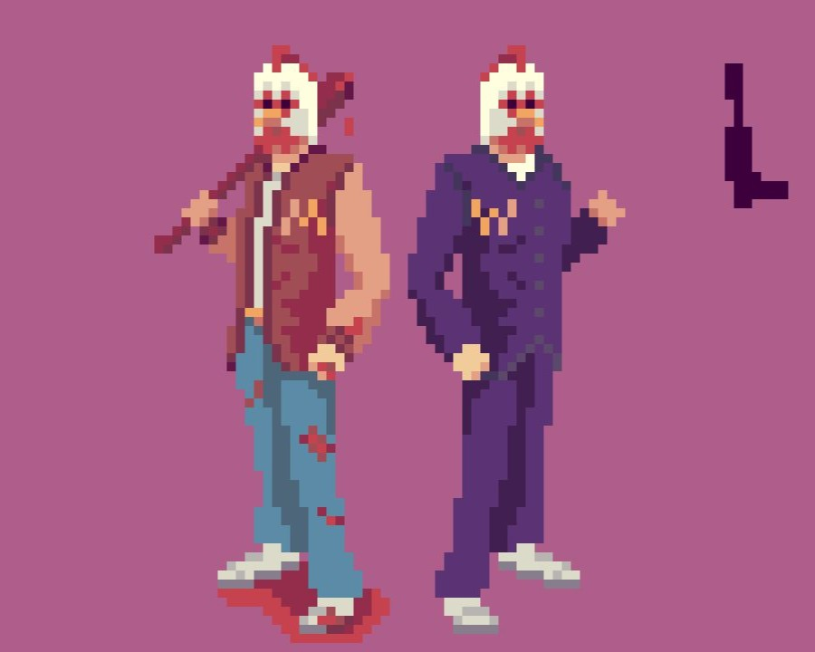

### NickName: Wizaru_Dono
#### Name: Дмитрий Мальцев
#### tg: @YNKEW

#### Роли: 
1. Геймдизайнер: занимаюсь всем - от анализа рынка и создания концептов до маркетинга;
2. Программист: делаю игры на Godot;
3. Художник: рисую и анимирую Pixel_Art.

#### Соцсети
1. [Telegram](https://t.me/wizardupixel)
2. [YouTube](https://www.youtube.com/@wizaru_dono)

#### Опыт
Участие (коллаборации) в джемах по созданию игр, артов и анимаций:
- [LOWREZJAM 2025](https://itch.io/jam/lowrezjam-2025) и [проект](https://superiorita.itch.io/undo-it) в нём.
- [Открывающие окно игры для GameBoy](https://t.me/House_Pixel/25586/57479) | [запасная ссылка](https://t.me/wizardupixel/31) и [проект](https://www.youtube.com/watch?v=hVzrgjlUtfU) в нём.

А также создание простеньких игр в учебных целях (в т.ч. для обучения нейронных сетей).

# Мои работы
#### Что бы показать?

## Игры
### Локации RPG_1 (без полировки)
#### Город

#### Комната (для кат-сцен)

### UI к RPG_2
Наброски интерфейса к игре:

#### Реализация в Godot:

*Нажмите на изображение или [ссылку](https://youtu.be/Mw53esq9j4Q), чтобы посмотреть демонстрацию работы.*

### Гонки
#### Спидометр

#### Заставка

#### Реализация в Godot:

*Нажмите на изображение или [ссылку](https://youtu.be/tWtL32eGhqo), чтобы посмотреть демонстрацию работы.*

## Анимации
#### Поединок самураев (Самурай Чамплу)

*Нажмите на изображение или [ссылку](https://www.youtube.com/watch?v=7CTbvyl3OPM), чтобы посмотреть демонстрацию работы.*

#### Как облегчить Сизифов труд:

*Нажмите на изображение или [ссылку](https://www.youtube.com/shorts/Tmp67qj_Z_s), чтобы посмотреть демонстрацию работы.*

#### Заставка Warcraft III

*Нажмите на изображение или [ссылку](https://www.youtube.com/watch?v=hVzrgjlUtfU), чтобы посмотреть демонстрацию работы.*

## Арты
#### Паладин/ша:
 ㅤ

#### Тяночки
Чертовка

Монашка

Харли Квинн

Призрак-тян

 ㅤ ㅤ

Мегумин

 ㅤ

Юнити (в качестве рефа)

Волшебница

Азула (в качестве рефа)

В поисках стиля

 ㅤ

#### Мечи
 ㅤ  ㅤ

#### Стикеры
    ㅤ

#### Оптические иллюзии
Игра: найдите корову справа

 ㅤ

Если нашли, у вас шиза (=

## Все мы с чего-то начинали...
#### Раннее творчество

 ㅤ

